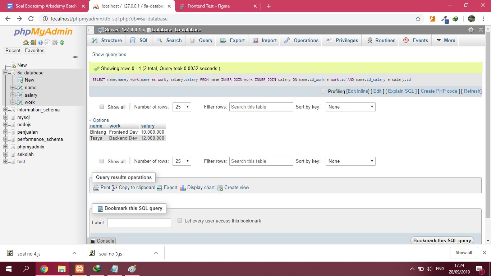

# Arkademy-Bootcamp-12-5

Kegunaan JSON :
JavaScript Object Notation atau disingkat JSON adalah sebuah format data untuk penukaran, pengiriman atau penyimpanan data yang digunakan pada REST API. 
JSON pada REST API adalah sebagai format untuk bertukar data client dan server. 
JSON sangat berguna pada REST API terutama untuk pengelolaan data antar platform karena JSON dapat digunakan pada banyak bahasa pemrograman. Dan penggunaan JSON lebih mudah ketimbang XML karena struktur data JSON mirip Array.

Capture/Screenshot 

Query :

Demo Aplikasi :

Tampilan View

Add Data

Delete Data

Edit Data

